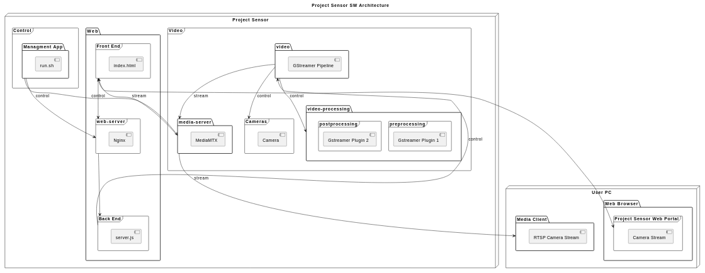

# project-sensor

## Web Portal


## SW Architecture



## Install

```bash
cd ~
git clone https://github.com/shalex88/project project --recurse-submodules
cd ~/project
./install.sh
```

## Run

```bash
cd ~/project
./run.sh
```

## Update

```bash
cd ~/project
git pull -r --recurse-submodules
```

Open a web browser and go to `http://localhost/` (on target) or `http://TARGET_IP/` (on host)
