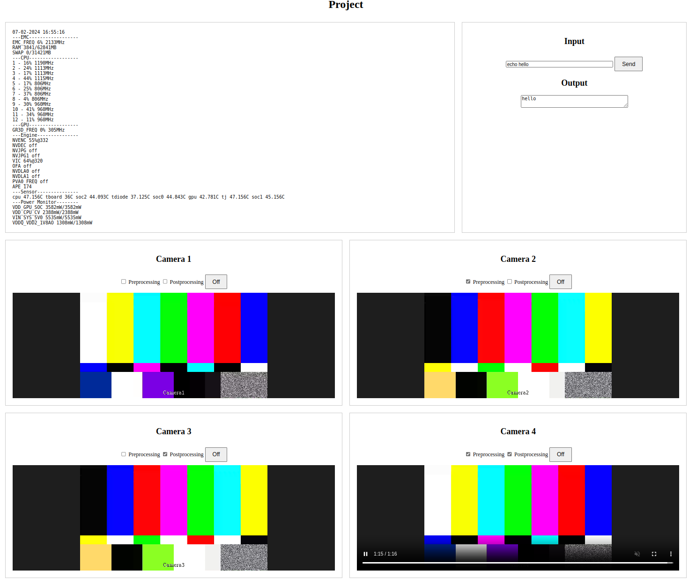
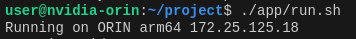

# project-sensor



## Prerequisites

NVIDIA Jetson AGX Orin with JetPack 6.0 (L4T 36.3)
or
Docker intalled on host system

```bash
# Install docker
curl -fsSL https://get.docker.com -o get-docker.sh
sudo sh get-docker.sh && rm get-docker.sh
sudo groupadd docker
sudo usermod -aG docker $USER
newgrp docker
docker run hello-world
```

## Install

NVIDIA Jetson AGX Orin

```bash
cd ~
git clone https://github.com/shalex88/project --recurse-submodules
cd ~/project
./install.sh
```

ARM64/AMD64

```bash
docker pull shalex88/project
```

## Run

NVIDIA Jetson AGX Orin

```bash
./app/run.sh
```

ARM64/AMD64

```bash
docker pull shalex88/project
```

## Usage



Open a web browser and go to `http://localhost/` (on target) or `http://TARGET_IP/` (on host)
