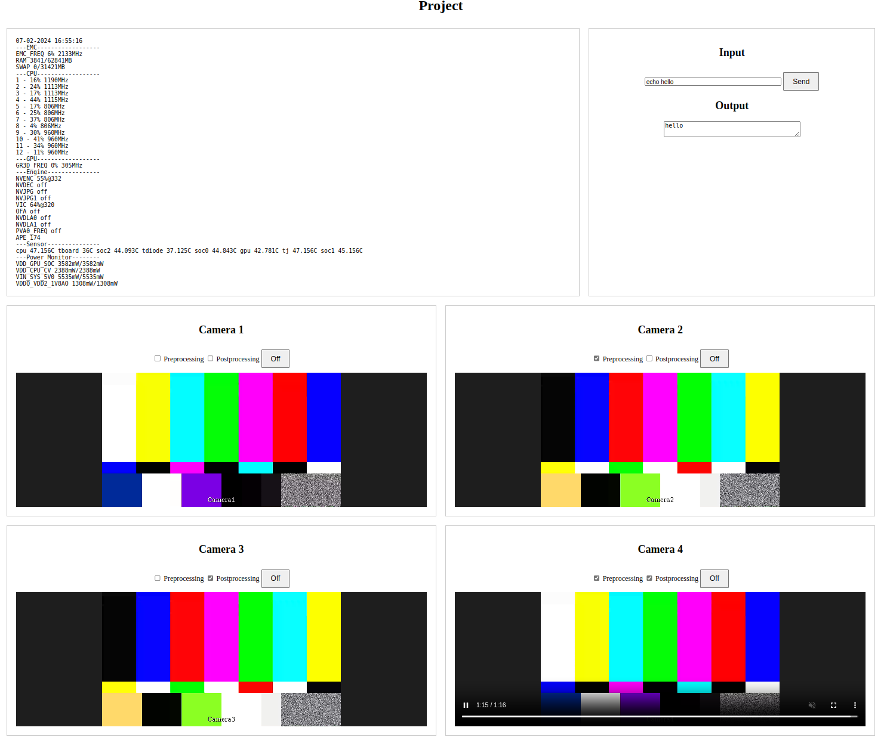
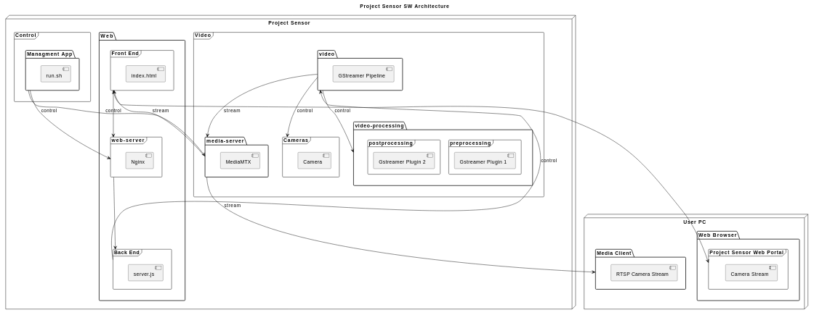

# project-sensor

## Web Portal



## SW Architecture



## Prerequisites

NVIDIA Jetson AGX Orin with JetPack 6.0 (L4T 36.3)
or
Docker intalled on host system

## Install

```bash
# Install docker
curl -fsSL https://get.docker.com -o get-docker.sh
sudo sh get-docker.sh && rm get-docker.sh
sudo groupadd docker
sudo usermod -aG docker $USER
newgrp docker
docker run hello-world

# Install the project image
docker pull shalex88/project
```

## Run

```bash
docker run -it shalex88/project
```

# Development

## Install

```bash
cd ~
git clone https://github.com/shalex88/project -b develop --recurse-submodules
cd ~/project

# Native
./install.sh

# Docker
#TODO Use multiarch build
docker build -t shalex88/project --load docker/

docker build -t shalex88/project --push docker/
```

## Update

```bash
cd ~/project
git pull -r --recurse-submodules
```

Open a web browser and go to `http://localhost/` (on target) or `http://TARGET_IP/` (on host)
