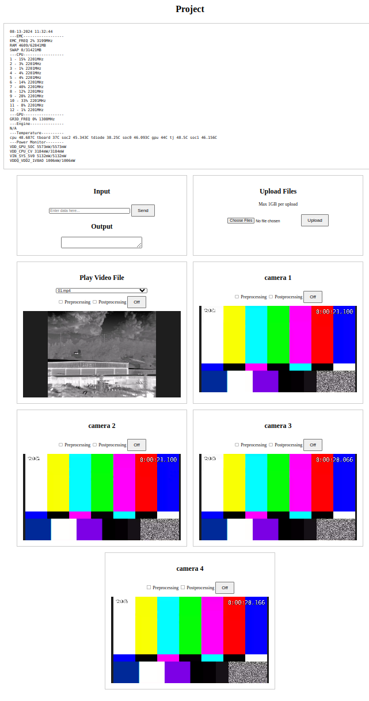

# project-sensor

## Web Portal



## SW Architecture


## Prerequisites

NVIDIA Jetson AGX Orin with JetPack 6.0 (L4T 36.3)

## Install

```bash
cd ~
git clone https://github.com/shalex88/project --recurse-submodules
cd ~/project
./install.sh
```

## Run

```bash
# Start
sudo systemctl start project
# Restart
sudo systemctl restart project
# Stop
sudo systemctl stop project
# Enable autorun
sudo systemctl enable project
# Disable autorun
sudo systemctl disable project

```

## Update

```bash
cd ~/project
git pull -r --recurse-submodules
```

Open a web browser and go to `http://localhost/` (on target) or `http://TARGET_IP/` (on host)
